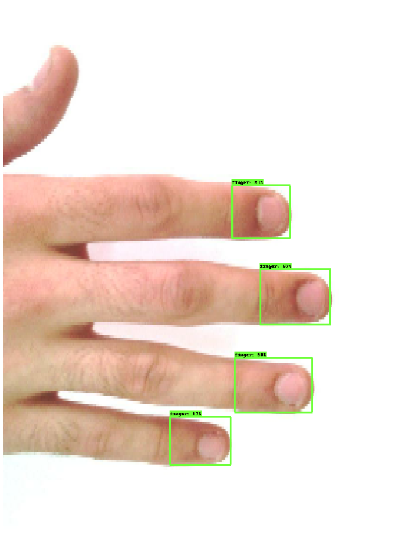

# Multi Finger Detection 
[](http://robotics.coe.utah.edu/)

_Author: Navid Fallahinia, University of Utah Robotics Center_

_n.fallahinia@utah.edu_

## Requirements

We recommend using python3 and a virtual env. When you're done working on the project, deactivate the virtual environment with `deactivate`.

```
$ virtualenv -p python3 .env
$ source .env/bin/activate
$ pip install -r requirements.txt
```

Note that this repository uses Tensorflow 2.3.0 and `tf.keras` API. There are major changes between TF 1 and TF 2 and this program does NOT support TF 1. 

Introduction to TF 1 vs. TF 2:
- [programmer's guide](https://www.tensorflow.org/guide/migrate)

## Task

Given an image of a human finger, returns the bounding box around each finger in the frame using SSD object detection. The model is built based on MobileNet-V2. You can alos read about the SDD here:

- The original paper: [here](https://arxiv.org/abs/1512.02325)
- Some implementation: [here](https://towardsdatascience.com/understanding-ssd-multibox-real-time-object-detection-in-deep-learning-495ef744fab)

The model is traind using Fingernail dataset (~8.6 GB) that contains raw and annotated finger images. 

Unfortunately, the Fingernail dataset is not publicly available at this time. However, you can email the [author](n.fallahinia@utah.edu) to receive the datatset. 

## Quick Run

1. **Build the TFrecords**: make sure you complete this step before training

```bash
$ python3 tfrecords_convertor.py --labels_path {$LABELS_PATH} --output_path {$OUTPUT_PATH} --image_dir {$IMAGE_DIR}
```

2. **Setup the training parameters**: There is a `mobilenet_v2.config` file for you under the main directory. You can set the parameters for the training. Tensorflow OD API uses this config file for precessing the training and evaluation tasks.

3. **Train the model**. Simply run:
```
python3 model_main_tf2.py --model_dir {$MODEL_DIR} --num_train_steps {$NUM_TRAIN_STEPS} --pipeline_config_path {$PIPELINE_CONFIG_PATH} --alsologtostderr 
```
4. **Export the model**. Once the training is over, you should export the ckpt-?-data checkpoint into TF2 saved model. This can be done by running the following command:
```
 python3 exporter_main_v2.py --trained_checkpoint_dir {$TRAIN_DIR} --output_directory {$NUM_TRAIN_STEPS} --pipeline_config_path {$OUTPUT_PATH} 
```
 5. **Test the model**. You can run the inference test to see the detected fingers.

<p align="center">
    
    
    
    
</p>
